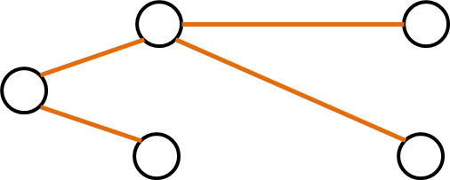
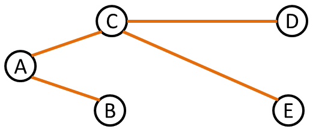
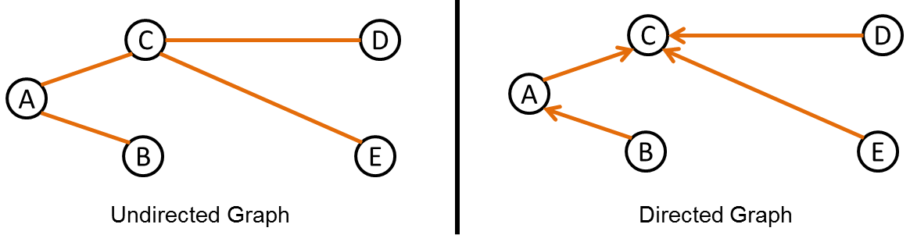
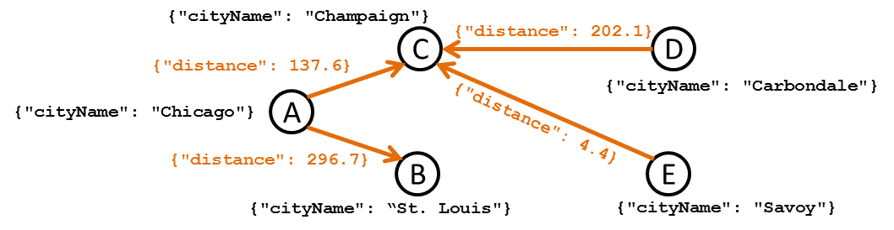
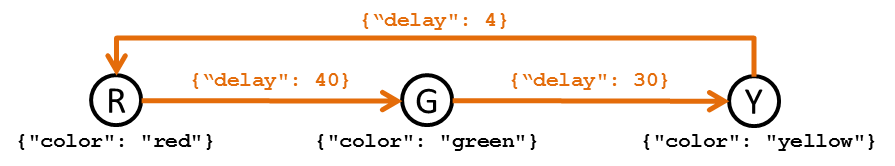
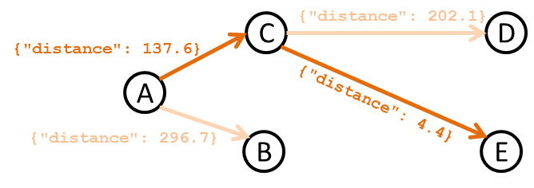

<style>img { max-height: 200px; margin: 0px auto; text-align: center; }

# Graphs in Python

## Overview of a Graph

One of the most powerful data structures in Computer Science is a graph.
A graph is a set of **nodes** that are connected to other nodes via **edges**.

Graphs can easily be stored by a computer and can also be easily visualized.
A graph of five nodes and four edges is visualized below:




### Nodes

In a graph, every node must have a unique name that identifiers the node from
every other node.  In general, the name of the node will either be a number
or a string.  Extending the above graph, names are added to the nodes:




### Edges

In a graph, edges do not have names.  Instead, an edge is identified by the
**source node** and **target node** that the edge connects.  In the sample graph above,
the edges are: `("A", "B")`, `("A", "C")`, `("C", "D")`, and `("C", "E")`.


### Directed / Undirected Graphs

Every graph is either a **directed graph** or an **undirected graph**.
An edge in a directed graph can only be traveled from the source node to the
target node, while an edge in an undirected graph may also be traveled backwards.

Every edge in a graph must either be directed or undirected,
as an entire graph is either directed or undirected.  A directed edge is
visually encoded with an arrow showing the direction of the edge.
If arrows are not present on edges in a visualization of a graph, the
graph is undirected.




### Node and Edge Attributes

Finally, every node and every edge contains a dictionary of attributes.  As with
all dictionaries, these attributes are key-value pairs.  Attributes are used to
store what each node and edge represent in the problem that is being solved.

One example of a graph is a model of a road network.  In this model, each
node is a city and each edge is the distance between the two cities.  The name
of the city would be an attribute on every node and the distance between two cities
would be an attribute on every edge:




A second example of a graph is a model of a stop light.  In this model, every node
is a color displayed on the stoplight ("red", "yellow", and "green") and every
edge is a transition between the colors.



Note that there is no edge `(G, R)` because a stop light will never go directly
from green to red.  The only path from `G` to `R` is through `Y`.


## Encoding a Graph in Python

In Python, we will use the `networkx` library to encode our graph into a
data structure.  This library allows us to use graphs to solve problems without
being concerned about the inner-workings of the graph.

Every program that uses a graph will need to include this library by using the
following import:

```py
import networkx as nx
```


### Creating the Graph Object

Every graph must be either a directed graph or an undirected graph.  Before any
nodes or edges are created, a **graph object** must be created in Python.  Depending
on your choice of a directed or undirected graph, a graph object is created using
one of the following commands:

```py
G = nx.Graph()    # Creates a undirected graph
G = nx.DiGraph()  # Creates a directed graph
```

It is a common convention to use the variable `G` to represent a graph when only
a single graph is used.  By using `G` for a graph, it is clear to others that the
variable contains a graph object.


### Adding Nodes to the Graph

With a graph object, nodes are added with the `add_node` method.  This method
requires a unique name for the node (different than every other node already
in the graph) and, optionally, can add any number of attributes to the node.

To add a node to `G` with the name `"A"` and no attributes:

```py
# In graph G, creates a new node named "A" with no attributes
G.add_node("A")
```

To add a node to `G` with the name `"B"` and one attribute `"cityName": "Champaign"`:

```py
# In graph G, creates a new node named "B" with one attribute
G.add_node("B", cityName="Champaign")
```

To add a node to `G` with the name `"C"` and tree attributes:

```py
# In graph G, creates a new node named "C" with three attributes
G.add_node("C", cityName="Champaign", state="IL", country="USA")
```

Finally, you can also apply attributes to a node by using an existing dictionary.
To use the key/values from an existing dictionary, set the attribute `attr_dict`
equal to the dictionary:

```py
data = {
  "cityName": "Champaign",
  "state": "IL",
  "country": "USA"
}
# In graph G, creates a new node named "D" with three attributes
G.add_node("D", attr_dict=data)
```


### Adding Edges to the Graph

With a graph object, nodes are added with the `add_edge` method.  This method
requires a unique source/target pair of node names.  Identically to `add_node`,
this method also accepts attributes after the pair of node names are provided.

```py
# In graph G, adds an edge between "A" (source) and "B" (target) with no attributes
G.add_edge("A", "B")

# In graph G, adds an edge between "B" (source) and "C" (target) with one attribute
G.add_edge("B", "C", distance=12)

# In graph G, adds an edge between "C" (source) and "A" (target) with three attributes
G.add_edge("C", "A", distance=12, time=18, road="Highway")
```


## Accessing the Graph

After a graph is created, NetworkX provides several ways to access data about
your graph.

### Accessing Node Names and Node Attributes

To access data for every node, `G.nodes(data=True)` provides a list of
`(name, attribute dictionary)` tuples of every node in your tree.
This is best used with a loop, in order to perform an action on each node:

```py
# Loop through every node in G:
for node in G.nodes(data=True):
  # Extract the node_name and the node attribute dictionary:
  node_name = node[0]   # A string, ex: "A"
  node_attrs = node[1]  # A dictionary, ex: {"cityName": "Champaign"}
```

To access data about a specific node in `G`, `G.node["myNodeName"]` provides
an attribute dictionary.

```py
# Access attributes about node "A":
node_attrs = G.node["A"]  # A dictionary, ex: {"cityName": "Champaign"}
```

### Accessing Edges of Nodes

To access all of the edges of a specific node in `G`, `G["myNodeName"]` returns a
dictionary where the keys are names of target nodes and the values are the attributes
of the edge.  This is often used in a loop, in order to perform an action on
each edge of a node:

```py
# Loop through every edge coming out of "A"
#  (every edge with "A" as the source node)
for target_node_name, edge_attrs in G["A"].items():
  # target_node_name contains the name of the target node; a String, eg: "B"
  # edge_attrs contians a dictionary of attributes about the edge; eg: {"weight": 100}
  ...
```


Alternatively, this same method can be used to find a list of all of the target
nodes without accessing the attributes:

```py
# Creates a list of all node names that have an edge coming from "A"
target_node_names = list(G["A"].keys())  # ["B", "C", "D"]
```


To access on specific edge in `G`, you must know then name of the source and target
nodes.  `G["sourceNode"]["targetNode"]` returns the attributes of the edge.

```py
# Find the attributes of the edge ("A", "B")
edge_attrs = G["A"]["B"]  # A dictionary, ex: {"weight": 100}
```


The preceding code will throw an error if the edge does not exist.  A method is
provided to check if an edge exists in `G`:

```py
# Checks if G contains the edge ("A", "B")
hasEdge = G.has_edge("A", "B")  # A boolean, either True or False
```

### Example: Accessing a Path

A very common operation on a graph is to access a **path**.  A path is a series
of nodes, connected with edges.  A path is described by the nodes in the order
they are visited.

The path `["A", "C", "E"]` through a graph of five nodes is highlighted below:



We can access every node and edge along the path by using the functions
described above:

```py
# Create a path:
path = ["A", "C", "E"]


# == NODES ==
# Access each node in the path:
for node_name in path:
  # Get the attributes about the node:
  node_attr = G.node[node_name]

  # Use node_name and node_attr to read/change/update the node:
  # (...this will differ depending on the goal of your program...)
  node_attr["visisted"] = True


# == EDGES ==
# Access each edge in the path:
# ...since there is no edge from the last node, we will visit every node
#    except the last node.  Therefore, we will create a loop from i=0->len()-1:
for i in range(len(path) - 1):
  # Find the edge attributes about the edge between two nodes
  source_node_name = path[i]
  target_node_name = path[i + 1]
  edge_attr = G[ source_node_name ][ target_node_name ]

  # Use source_node_name, target_node_name, and edge_attr to read/change/update the edge:
  # (...this will differ depending on the goal of your program...)
  edge_attr["visited"] = True
```
